# 🎨 Drawing Tools Product Catalog System

## 📌 About This Project

The **Drawing Tools Product Catalog System** is a **Windows Forms Application (WinForms)** built using **VB.NET** and **.NET Framework**. It is designed to manage a product catalog for a drawing tools store, allowing staff to efficiently handle **customer orders, product inventory, and staff management**.

This system enables users to:
- **Manage staff, customers, and orders**
- **Create, modify, and delete orders**
- **Generate invoices for completed orders**
- **View and modify product details**
- **Store and retrieve data from a Microsoft Access database**

---

## 🔧 Features
### 🏬 **Product Management**
- View **product catalog** and product details  
- Modify product details (price, stock, etc.)  
- Add or remove products from the catalog  

### 🛒 **Order Management**
- Create new orders  
- Generate and view **invoices**  
- List all orders with details  
- Modify existing orders  

### 👨‍💼 **Staff & Customer Management**
- View and modify **staff details**  
- Add or remove **customers**  
- Store customer contact information  

### 📊 **Database Integration**
- **Microsoft Access** used for data storage  
- Uses **SQL queries** for data retrieval and modification  

---

## 🖥️ Project Preview

### **Load Dashboard**  
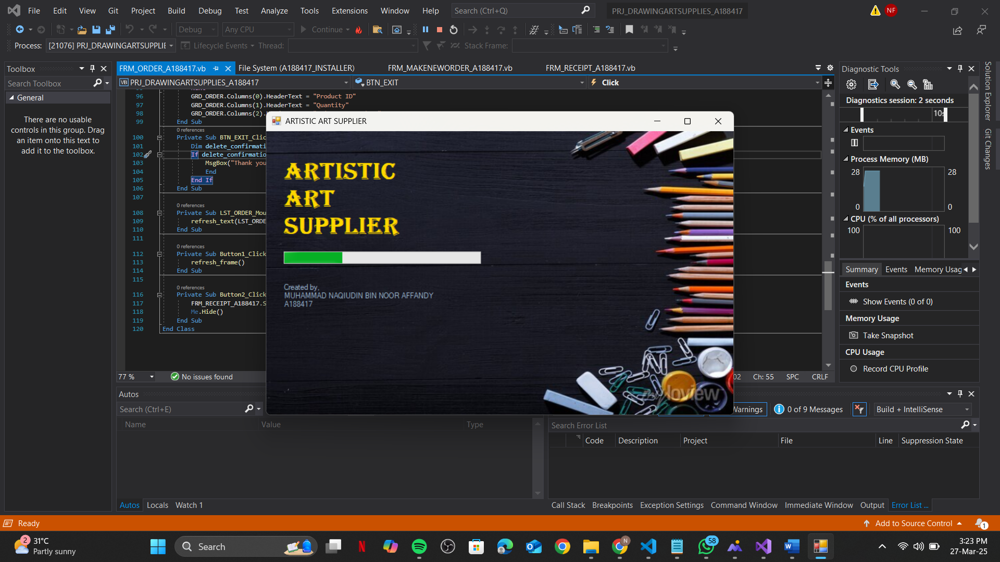  

### **Login**  
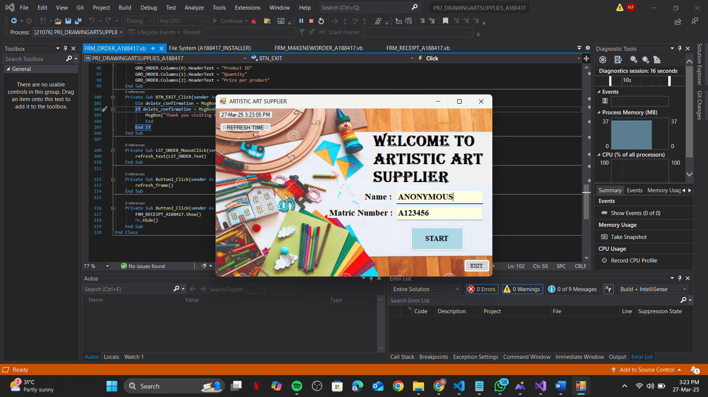  

### **Succesfull login**  
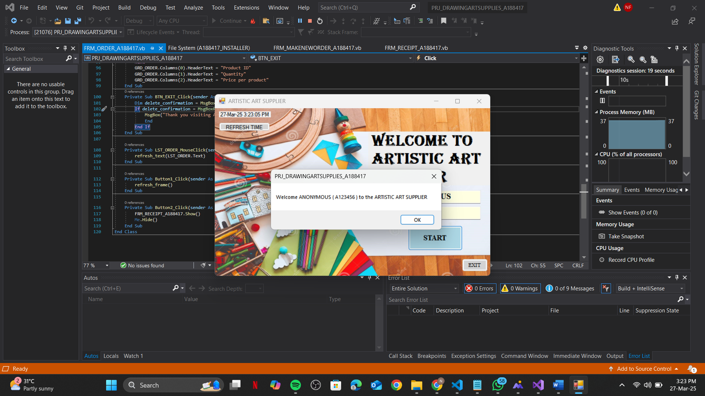  

### **Main Menu**  
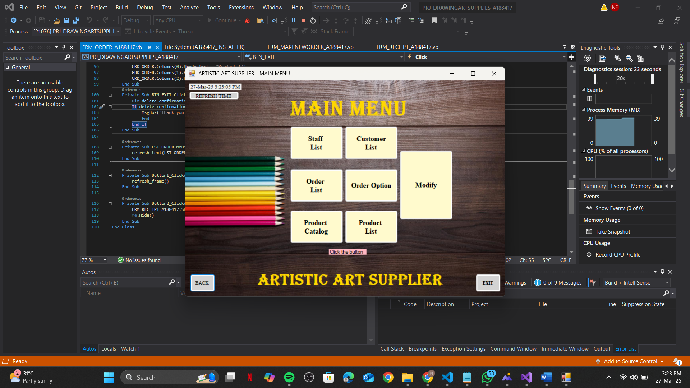  

### **Staff Information**  
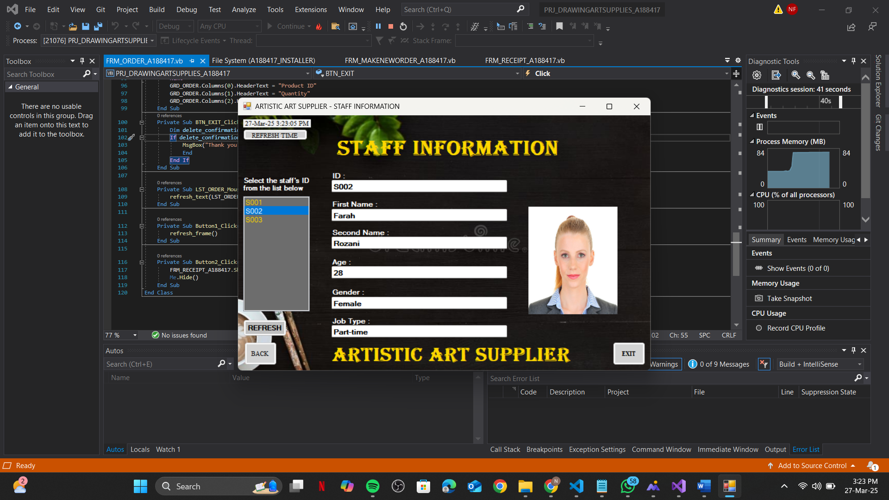  

### **Customer Details**  
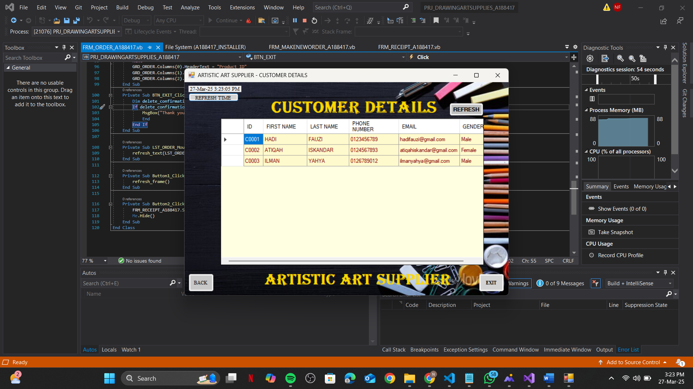  

### **Order History**  
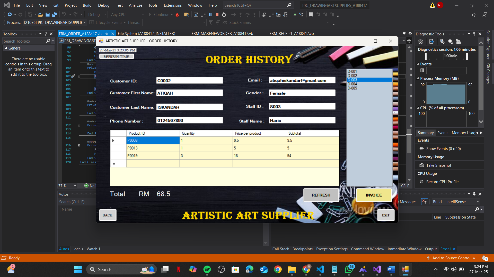  

### **Invoice and Receipts**  
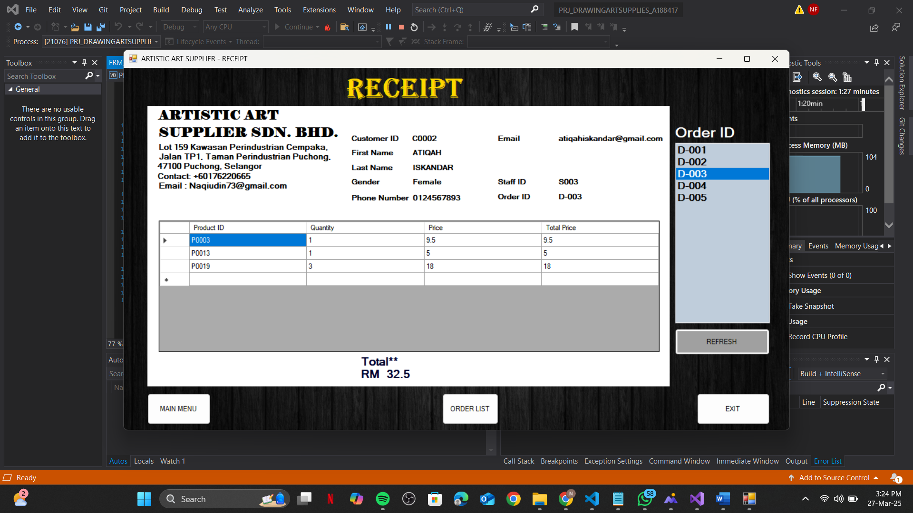  

### **Order**  
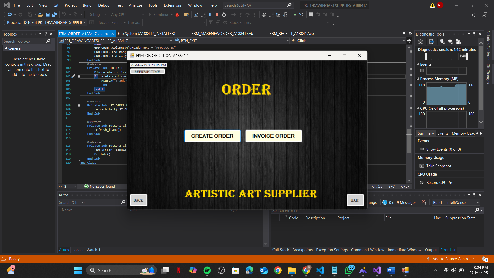  

### **Create Order**  
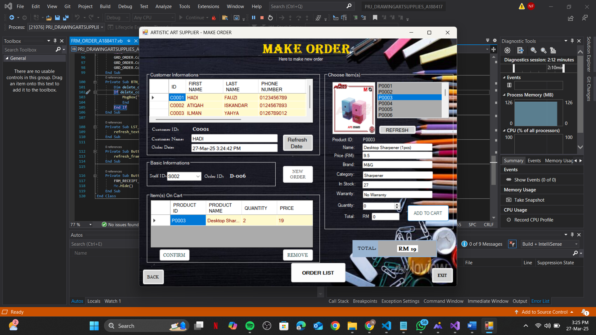  

### **Product Catalog**  
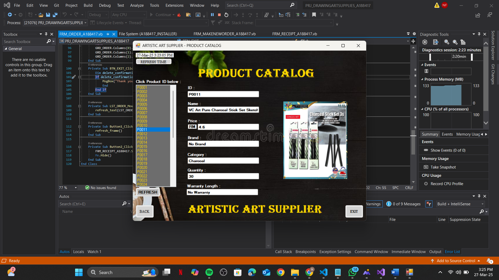  

### **Prooduct List**  
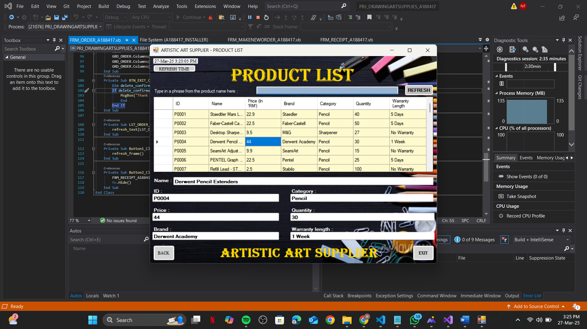  

### **Modify Product**  
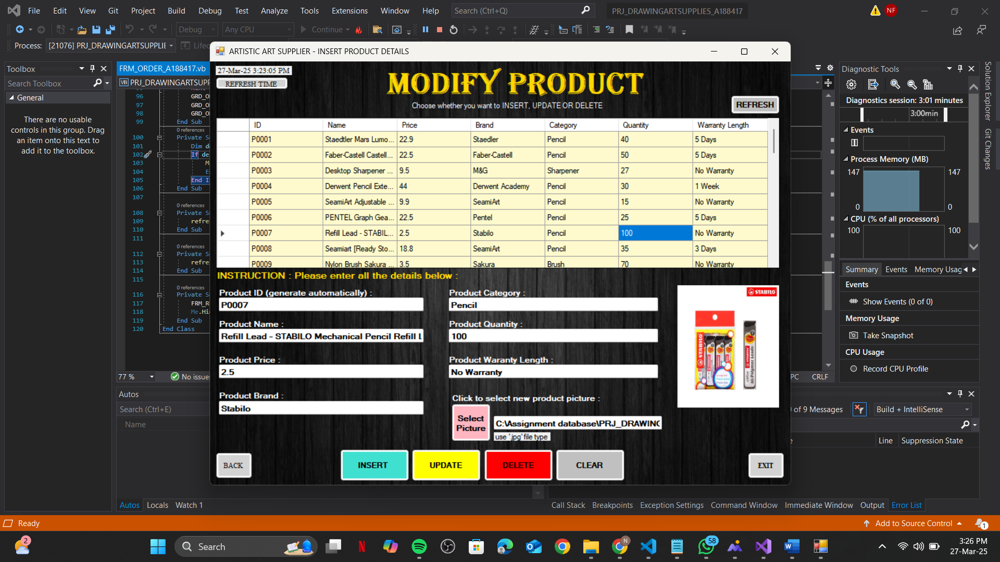  

### **Modify Customer**  
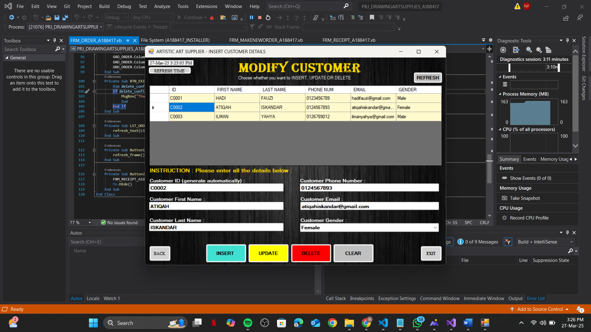  


---

## 🛠️ Technologies Used
### **Programming Language & Frameworks**
- **VB.NET** (Visual Basic .NET)  
- **.NET Framework**  

### **Database**
- **Microsoft Access**  

### **Development Tools**
- **Visual Studio 2019**  
- **Microsoft Access**  

### **Libraries & Components**
- **Windows Forms (WinForms)**  
- **OleDb for Database Connection**  

---

## 🚀 Getting Started

### **1️⃣ Clone the Repository**
```sh
git clone https://github.com/yourusername/drawing-tools-catalog.git
